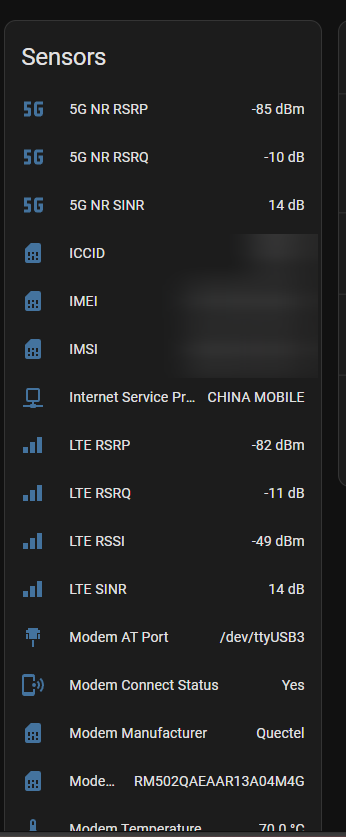
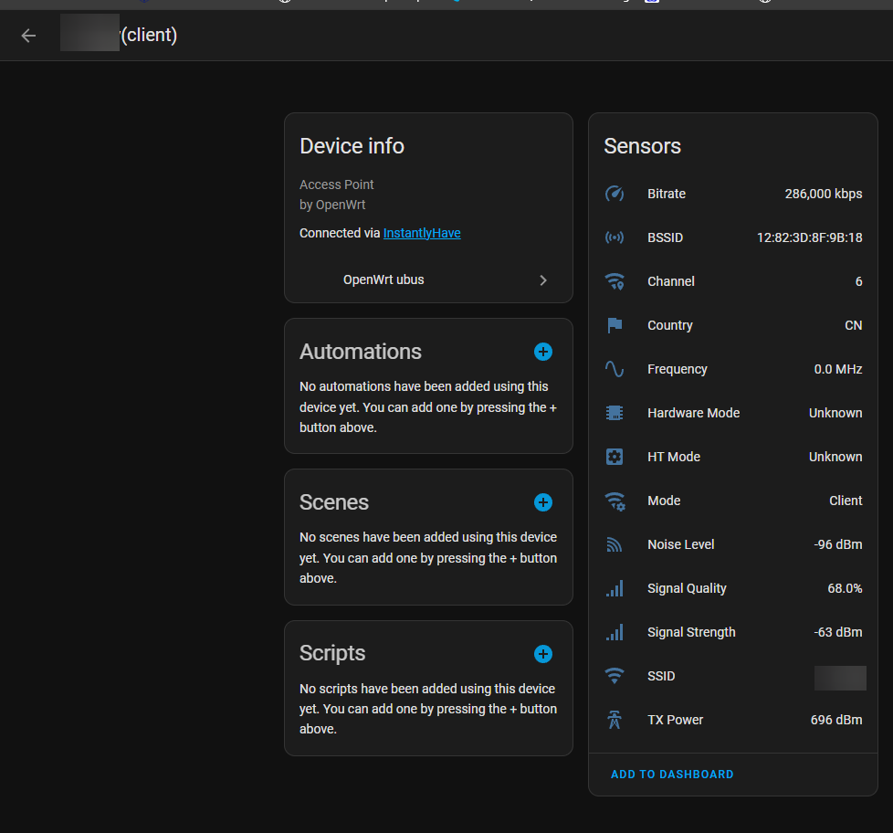
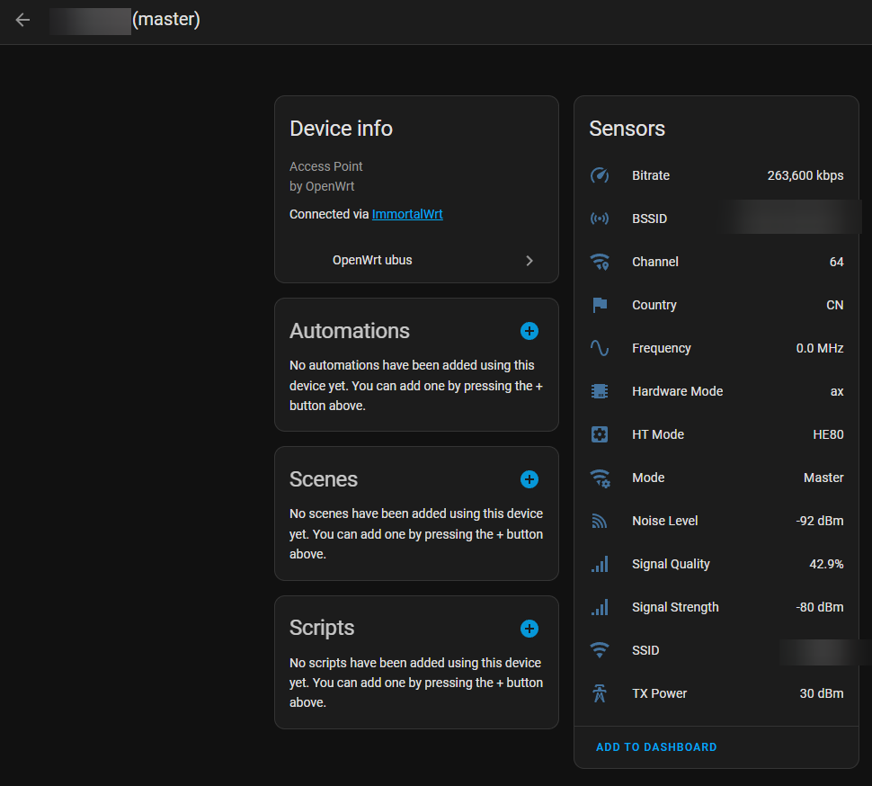
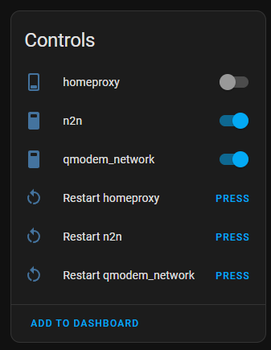
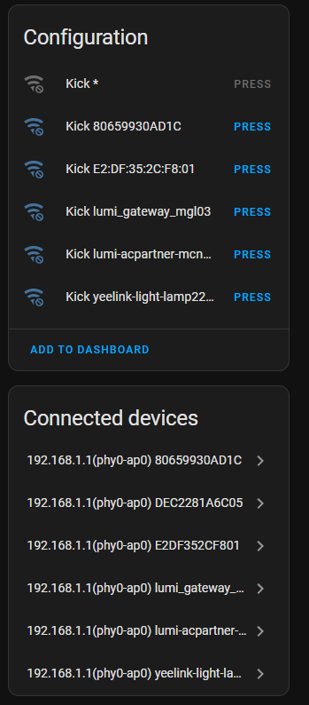
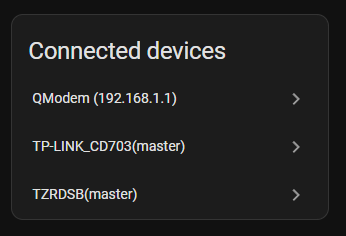

# OpenWrt ubus for Home Assistant

**English Version** | [中文版本](README_zh.md)

`openwrt_ubus` is a Home Assistant custom integration for OpenWrt routers. It connects to OpenWrt over ubus JSON-RPC and exposes router status, wireless access point data, connected clients, optional wired clients, service controls, and an integration-native topology page.

## Overview

This fork focuses on practical day-to-day monitoring and control:

- Router system sensors
- AP and station sensors
- Optional QModem sensors
- Optional network interface sensors
- Per-device `device_tracker` entities
- Optional wired client tracking
- Service switches and control buttons
- Wireless client kick buttons
- A built-in topology page for this integration

The topology page is not a Lovelace card. It is registered by the integration itself and can be opened from the integration options menu or directly at `/openwrt-ubus-topology`.

## Features

### Device tracking

## 🆕 Release Notes

### v2.1 - NLBWMon Optional Toggle
- Added a new config toggle: **Enable NLBWMon Top Hosts Sensor** in both initial setup and options flow.
- New installations now default this toggle to **Disabled** to reduce recurring log errors on routers/APs that do not use `nlbwmon`.
- Added startup capability probing so NLBWMon entities are skipped when `/usr/sbin/nlbw` or required ubus permissions are unavailable.
- Existing installations keep legacy behavior unless you explicitly change the toggle.

**Recommended setting for AP/non-router or minimal OpenWrt installs:** keep NLBWMon disabled unless `nlbwmon` is installed and ACL allows `file.exec` for `/usr/sbin/nlbw`.

### 1️⃣ AP Interface Management
Monitor and manage OpenWrt access point (AP) interfaces with detailed status information:
- **� AP Master Mode**: View hosted wireless networks with SSID, encryption, channel information, connected client counts, and bandwidth utilization
- **📶 AP Client Mode**: Monitor connection to upstream wireless networks with signal strength, data rates, and connection quality metrics
- **🔧 Real-time Status**: Live updates of wireless standards (802.11n/ac/ax), channel width, and connection stability
- **📊 Performance Metrics**: Track data throughput, signal quality, and interference levels

### Sensors

- System sensors: uptime, load, memory, board data, temperatures, conntrack, DHCP count and more
- AP sensors: SSID, channel, frequency, mode, bitrate, signal/quality and related wireless metrics
- STA sensors: per-client wireless metrics such as RSSI, bitrate, connection time and AP association
- ETH/interface sensors: bridge, Ethernet, DSA and other network interface counters and status
- QModem sensors when `modem_ctrl` is available

### Service management

- Lists procd-managed services from `rc`
- Creates switch entities for selected services
- Creates buttons for start, stop, restart, enable and disable actions

### Wireless client control

- Optional per-client kick buttons for `hostapd`-managed wireless clients
- Intended for AP mode interfaces that expose `hostapd.*` ubus methods

### Topology page

- Built-in graph page for router, APs, wireless clients and wired clients
- Keeps recently-missing clients visible as offline for a short grace period
- Clickable main nodes that open the corresponding Home Assistant device page
- Discovery overlays for `zeroconf` and `ssdp`
- Protocol nodes are attached behind the matched client node and shown with dashed edges
- Discovery matching is conservative: first by IP, then by hostname, and only when the match is unique

## Requirements

Your OpenWrt router should provide ubus over HTTP or HTTPS.

Typical required packages:

```sh
opkg install rpcd uhttpd uhttpd-mod-ubus luci-app-uhttpd
```

Optional packages:

```sh
opkg install hostapd
```

Required services:

```sh
/etc/init.d/rpcd enable
/etc/init.d/rpcd start
/etc/init.d/uhttpd enable
/etc/init.d/uhttpd start
```

For best results, the Home Assistant user you use for this integration should have permission to:

- call ubus objects such as `system`, `iwinfo`, `hostapd.*`, `rc`, `uci`, `dhcp`, `network.device`, `luci-rpc`, `modem_ctrl`
- read files such as DHCP lease files when hostname resolution depends on them

## Installation

### HACS

Add this repository as a custom integration repository in HACS:

`https://github.com/Desmond-Dong/homeassistant-openwrt-ubus`

Then install `OpenWrt ubus`, restart Home Assistant, and add the integration from `Settings -> Devices & Services`.

### Manual

Clone or download this repository and copy `custom_components/openwrt_ubus` into your Home Assistant `custom_components` directory.

```sh
git clone https://github.com/Desmond-Dong/homeassistant-openwrt-ubus.git
```

Restart Home Assistant and add the integration from `Settings -> Devices & Services`.

## Router ACL example

If hostnames, file reads or service controls are missing because of permissions, grant the router user the needed ACLs.

Example full-access ACL for a trusted admin user:

```json
{
  "root": {
    "description": "Root user full access to ubus",
    "read": {
      "ubus": {
        "*": ["*"]
      }
    },
    "write": {
      "ubus": {
        "*": ["*"]
      }
    }
  }
}
```
#### For advanced users
If you want to use a different user from root or have more fine grained control over root access over ubus, substitute "root.json" with "youruser.json" in the line below and inside json:
```bash
# Create ACL file for Home Assistant
cat > /usr/share/rpcd/acl.d/root.json << 'EOF'
{
  "root": {
    "description": "Home Assistant access",
    "read": {
      "ubus": {
        "session": [ "access", "login", "list", "destroy" ],
        "system": [ "board", "info" ],
        "iwinfo": [ "devices", "info", "assoclist" ],
        "hostapd.*": [ "*" ],
        "network.interface": [ "dump" ],
        "network.device": [ "status" ],
        "network.wireless": [ "status" ],
        "dhcp": [ "ipv4leases", "ipv6leases" ],
        "file": [ "read" ],
        "uci": [ "get" ],
        "rc": [ "list", "init" ],
        "mwan3": [ "get" ]
      },
      "file": {
        "/proc/stat": [ "read" ],
        "/etc/ethers": [ "read" ],
        "/tmp/dhcp.leases": [ "read" ],
        "/var/dhcp.leases": [ "read" ]
      }
    },
    "write": {
      "ubus": {
        "hostapd.*": [ "del_client" ],
        "file": [ "exec" ],
        "rc": [ "init" ]
      },
      "file": {
        "/usr/sbin/nlbw": [ "exec" ]
      }
    }
  }
}
```

Save it under `/usr/share/rpcd/acl.d/root.json`, then restart `rpcd` and `uhttpd`.

> **NLBWMon note**: `file.exec` for `/usr/sbin/nlbw` is only required when the NLBWMon top-hosts sensor is enabled. AP-only or minimal OpenWrt installs can leave NLBWMon disabled.

## 🎛️ Features & Configuration

### Connection options

| Option | Meaning | Default |
| --- | --- | --- |
| `host` | OpenWrt hostname or IP | required |
| `username` | Router username | required |
| `password` | Router password | required |
| `use_https` | Use HTTPS instead of HTTP | `false` |
| `verify_ssl` | Verify router certificate | `false` |
| `cert_path` | Optional client certificate path | empty |
| `port` | Custom ubus web port | `80` or `443` |
| `endpoint` | ubus URL path | `ubus` |
| `tracking_method` | Device tracker unique ID strategy | `combined` |
| `wireless_software` | Wireless data source | `iwinfo` |
| `dhcp_software` | DHCP/lease source for hostnames and IPs | `dnsmasq` |

### Feature toggles

| Option | Description | Default | Available Options |
|--------|-------------|---------|------------------|
| 🏠 **Host** | Router IP address | - | Any valid IP address |
| 👤 **Username** | Login username | - | Usually 'root' |
| 🔑 **Password** | Login password | - | Router admin password |
| 📡 **Wireless Software** | Wireless monitoring method | iwinfo | iwinfo, hostapd, none |
| 🌐 **DHCP Software** | DHCP client detection | dnsmasq | dnsmasq, odhcpd, /etc/ethers, none |
| 🚫 **Device Tracking Method** | Choose between tracking methods | combined | combined/uniqueid |
| ⏱️ **System Timeout** | System data fetch timeout | 30s | 5s-300s |
| 📊 **QModem Timeout** | QModem data fetch timeout | 30s | 5s-300s |
| ⚙️ **Service Timeout** | Service control timeout | 30s | 5s-300s |
| 🚫 **Device Kick Buttons** | Enable device kick functionality | Disabled | Enabled/Disabled |

### Timeout options

| Option | Meaning | Default |
| --- | --- | --- |
| `system_sensor_timeout` | System and interface polling timeout | `30` |
| `qmodem_sensor_timeout` | QModem polling timeout | `120` |
| `sta_sensor_timeout` | STA polling timeout | `30` |
| `ap_sensor_timeout` | AP polling timeout | `60` |
| `service_timeout` | Service status/action timeout | `30` |

### Service selection

When service controls are enabled, open the integration options and use the `Services` step to pick which OpenWrt services should create Home Assistant entities.

#### Device Tracking Methods

The integration offers two distinct tracking methods to accommodate different network topologies and use cases:

##### **`combined` - Per-AP Device Tracking (Default)**
This method creates separate entities for each device on each access point, treating each AP as an independent network.

**Characteristics:**
- **Separate Entities**: A device moving between APs creates distinct entities (e.g., `device_tracker.phone_ap1`, `device_tracker.phone_ap2`)
- **Entity Naming**: Includes AP hostname in entity ID (e.g., `ap-kitchen_sensor_mac_signal_avg`)
- **Device Hierarchy**: Devices appear as children of their current AP in the device registry (via `via_device`)
- **Best For**:
  - Independent access points with separate SSIDs
  - Networks where device location per AP is important
  - Tracking which specific AP a device is connected to
  - Scenarios requiring separate automations per AP

**Example Use Case:**
You have multiple APs (Guest Network, Office Network, IoT Network) and want to track if a device is on the office network vs. guest network with separate presence entities.

##### **`uniqueid` - Cross-AP Device Roaming**
This method creates a single entity per device that follows the device across all APs, ideal for mesh networks and roaming scenarios.

**Characteristics:**
- **Single Entity**: One entity per device regardless of connected AP (e.g., `device_tracker.phone`)
- **Entity Naming**: Excludes AP hostname, using only device identifier (e.g., `sensor_mac_signal_avg`)
- **Dynamic Attributes**: Current AP information exposed through attributes:
  - `router`: Current access point hostname (updates dynamically)
  - `ap_device`: Current AP device identifier
  - `ap_ssid`: Current connected SSID network name
- **No Device Hierarchy**: Devices are not linked to specific APs (no `via_device`), representing network-wide presence
- **Best For**:
  - Mesh networks where devices roam between APs
  - Single logical network across multiple physical APs
  - Scenarios where you care about presence, not AP location
  - Reducing entity clutter in multi-AP setups

**Example Use Case:**
You have a mesh network with 3 APs covering your home. You want a single presence sensor for your phone that shows "home" regardless of which AP it connects to, with the current AP available in sensor attributes.

##### Comparison Table

| Feature | `combined` | `uniqueid` |
|---------|-----------|-----------|
| **Entities per device** | Multiple (one per AP) | Single (network-wide) |
| **Entity ID format** | `ap-name_sensor_mac_attribute` | `sensor_mac_attribute` |
| **Roaming behavior** | Creates new entity on each AP | Updates attributes dynamically |
| **Device hierarchy** | Child of current AP | Independent device |
| **Current AP info** | Part of entity ID | Dynamic attribute |
| **Use case** | Per-AP tracking | Network-wide presence |

##### Migration & Entity Management

When switching between tracking methods or setting up for the first time:

1. **Automatic Migration**: The integration includes built-in migration functions that automatically update entity `unique_id` formats
2. **Clean Setup**: For best results with `uniqueid` method on existing installations:
   - Stop Home Assistant
   - Run cleanup script: `python3 cleanup_openwrt_buttons.py`
   - Restart Home Assistant
   - Entities will be recreated with correct format
3. **Entity Persistence**: Once created, entity IDs remain stable even when devices roam (with `uniqueid` method)

#### Wireless Device Detection
- **iwinfo Method**: Uses OpenWrt's iwinfo to detect wireless clients with system-level monitoring
- **hostapd Method**: Connects directly to hostapd daemon for real-time updates and kick functionality
- **Real-time Status**: Live updates when devices connect/disconnect with connection state tracking
- **Device Attributes**: MAC address, hostname, signal strength, connection time, and AP association

Open the topology page from:

- `Settings -> Devices & Services -> OpenWrt ubus -> Configure -> Topology`
- or `/openwrt-ubus-topology`


The graph shows:

- the router node
- AP nodes
- wireless client nodes
- wired client nodes
- optional `zeroconf` and `ssdp` discovery nodes attached behind clients

Protocol overlays are informational only. Main client nodes keep their normal device navigation behavior.

#### QModem LTE/4G/5G Support
Monitor cellular modem status for routers with LTE/4G/5G capabilities.


*QModem sensors showing LTE signal strength, connection status, and data usage*

**QModem Sensors Include:**
- **Signal Strength & Quality**: RSSI, SINR, and signal quality indicators
- **Connection Status**: Registration state, connection uptime, and network availability
- **Data Usage Statistics**: Transmitted and received data volumes
- **Network Information**: Operator name, cell tower ID, and technology type (4G/5G)
- **Modem Health**: Temperature monitoring and operational status
- **Connection Details**: IP address assignment and connection mode information

---

### 🌐 Access Point Management & Control

Monitor and manage wireless access points with detailed status information and control capabilities.

#### AP Client Mode

*Access Point in client mode - connected to upstream wireless network*

**Client Mode Features:**
- **Upstream Connection**: Monitor connection to parent access point
- **Signal Metrics**: Signal strength (RSSI) and quality to upstream AP
- **Performance Data**: Current data rates and connection stability
- **Network Information**: Connected SSID, channel, and security protocol
- **Roaming Support**: Track handoffs between upstream access points

#### AP Master Mode

*Access Point in master mode - hosting wireless network for clients*

**Master Mode Features:**
- **Connected Clients**: Real-time count of associated wireless devices
- **Channel Information**: Current channel, width, and interference levels
- **Network Configuration**: SSID, encryption type, and security settings
- **Performance Metrics**: Bandwidth utilization and throughput statistics
- **Coverage Analysis**: Signal propagation and coverage quality data

---

### 🎛️ Service Control & System Management

Comprehensive service management for OpenWrt system services with real-time status monitoring and control.


*Service control switches and buttons for managing OpenWrt system services*

#### Switch Entities
- **Service Switches**: Toggle services on/off with real-time status feedback
- **Live Status Monitoring**: Shows current running state of each monitored service
- **Batch Status Updates**: Efficient monitoring of multiple services simultaneously using optimized API calls
- **State Synchronization**: Automatic status refresh to maintain consistency with router state

#### Button Entities
The integration provides granular service control through dedicated button entities:

- **🟢 Start Service**: Start a stopped service with immediate status feedback
- **🔴 Stop Service**: Stop a running service with graceful shutdown
- **✅ Enable Service**: Enable service to start automatically on system boot
- **❌ Disable Service**: Disable auto-start on boot while preserving current state
- **🔄 Restart Service**: Restart a running service with minimal downtime

**Managed Services Include:**
Essential OpenWrt system services managed by procd:
- `dnsmasq` - DNS and DHCP server for network name resolution
- `dropbear` - Lightweight SSH server daemon for remote access
- `firewall` - Netfilter firewall configuration and management
- `network` - Network interface configuration and routing
- `uhttpd` - Web server for LuCI interface and ubus communication
- `wpad` - Wireless daemon for WPA/WPA2/WPA3 authentication
- `odhcpd` - DHCPv6 and IPv6 router advertisement daemon
- `rpcd` - RPC daemon for ubus JSON-RPC communication
- And many more system services based on your OpenWrt configuration...

**Service Management Features:**
- ⚡ Instant response to state changes with real-time feedback
- 🔄 Automatic status refresh after control operations
- 🛡️ Comprehensive error handling with detailed user feedback
- 📊 Optimized batch API calls for improved performance and reduced router load
- 🔍 Service dependency awareness for safe operation ordering

---
### MWAN3
When mwan3 sensors are enabled, a device will be created for each configured interface and policy.

#### MWAN3 Interface Entities
* Status - status of the interface: Online, Offline, Disabled
* Tracking - status of interface tracking: disabled, active
* Uptime - duration of interface uptime
* Tracking IP information: Up, Down, Skipped and Total counts

#### MWAN3 Policy Entities
* IPv4 and IPv6 interface list - List of currently used interface and percentage of traffic
* IPv4 and IPv6 Primary Interface - Current active interface with highest percentage of traffic
* IPv4 and IPv6 count of active interfaces

---

### 🔧 UCI Configuration Control (Advanced)

The integration also provides direct control over OpenWrt UCI configuration options via two Home Assistant services. This enables advanced use cases such as per-device internet toggles, dynamic firewall rules, and runtime configuration changes – all driven from Home Assistant.

#### `openwrt_ubus.uci_get`

Reads a UCI option value through ubus and can optionally store the result in a Home Assistant sensor entity.

**Fields:**

| Field | Required | Description |
|-------|----------|-------------|
| `config` | ✓ | UCI config name (e.g. `firewall`, `wireless`, `dhcp`) |
| `section` | optional | Section name or type/index (e.g. `block_user_7085c2` or `@rule[3]`) |
| `option` | optional | Option key to retrieve (e.g. `enabled`) |
| `target_entity_id` | optional | Sensor entity ID to update with the result (e.g. `sensor.block_user_7085c2_enabled`) |

**Example: store firewall rule status into a sensor**

```yaml
service: openwrt_ubus.uci_get
data:
  config: firewall
  section: block_user_7085c2
  option: enabled
  target_entity_id: sensor.block_user_7085c2_enabled
```

When `target_entity_id` is provided, the integration will update that entity's state with the retrieved UCI value (for example, `"0"` or `"1"`).

#### `openwrt_ubus.uci_set_commit`

Sets a UCI option value and immediately commits the change.

**Fields:**

| Field | Required | Description |
|-------|----------|-------------|
| `config` | ✓ | UCI config name |
| `section` | ✓ | Section name or type/index |
| `option` | ✓ | Option key to modify |
| `value` | ✓ | New value (string) |

**Example: enable a firewall rule (block a MAC address)**

```yaml
service: openwrt_ubus.uci_set_commit
data:
  config: firewall
  section: block_user_7085c2
  option: enabled
  value: "1"
```

**Example: disable the firewall rule (unblock)**

```yaml
service: openwrt_ubus.uci_set_commit
data:
  config: firewall
  section: block_user_7085c2
  option: enabled
  value: "0"
```

#### Example: Per-device Internet Toggle Using a Firewall Rule

You can combine the UCI services with a simple automation and template switch to create a per-device internet kill switch that uses a MAC-based firewall rule.

**1. Automation to keep sensor in sync with the firewall rule**

```yaml
automation:
  - alias: "Sync firewall state for user 7085C2"
    trigger:
      - platform: time_pattern
        minutes: "/1"
    action:
      - service: openwrt_ubus.uci_get
        data:
          config: firewall
          section: block_user_7085c2
          option: enabled
          target_entity_id: sensor.block_user_7085c2_enabled
```

**2. Template switch that uses the UCI-backed sensor for state and UCI calls for actions**

```yaml
switch:
  - platform: template
    switches:
      user_7085c2_internet:
        friendly_name: "User Internet 70:85:C2:89:EC:74"
        # ON = firewall rule disabled (0) = internet allowed
        value_template: >
          {{ is_state('sensor.block_user_7085c2_enabled', '0') }}
        turn_on:
          - service: openwrt_ubus.uci_set_commit
            data:
              config: firewall
              section: block_user_7085c2
              option: enabled
              value: "0"
        turn_off:
          - service: openwrt_ubus.uci_set_commit
            data:
              config: firewall
              section: block_user_7085c2
              option: enabled
              value: "1"
```

This pattern can be reused for additional firewall rules and devices by adjusting the `section`, `sensor` and `switch` names.

> **Note:** The UCI services require that the OpenWrt RPC user configured for this integration has ubus permissions to call `uci get`, `uci set` and `uci commit`.

---

### 🚫 Advanced Device Management & Control

Advanced device management capabilities including the ability to disconnect unwanted devices from your wireless network.


*Device kick buttons for disconnecting specific wireless clients*

#### Device Kick Functionality
Force disconnect connected wireless devices from your network with temporary access restriction.

**How Device Kick Works:**
1. **🔍 Auto Detection**: Automatically detects all connected wireless devices across all AP interfaces
2. **🆔 Dynamic Button Creation**: Creates individual kick buttons for each currently connected device
3. **✅ Intelligent Availability**: Buttons only appear and function when:
   - Target device is currently connected and active
   - hostapd service is running and accessible via ubus
   - Device is connected to a supported access point interface
   - User has appropriate permissions for device management
4. **⚡ Deauthentication Action**: Sends IEEE 802.11 deauthentication command to target device
5. **🕐 Temporary Access Ban**: Automatically prevents reconnection for 60 seconds
6. **🔄 Status Synchronization**: Refreshes device status immediately after kick action

#### Connected Devices Overview

*Comprehensive overview of all connected devices with management controls*

**Technical Requirements:**
- **📡 hostapd Service**: Must be installed, running, and accessible via ubus interface
- **🌐 Ubus Integration**: hostapd must be compiled with ubus support for device management
- **🔐 User Permissions**: Router user account must have appropriate ACL permissions for hostapd control

**Device Kick Button Details:**
- **Entity Naming**: `button.kick_[device_name]` or `button.kick_[mac_address]` for easy identification
- **Rich Attributes**: Each button includes device MAC, hostname, AP interface, signal strength, and connection time
- **Auto-Hide Behavior**: Buttons automatically disappear when target devices disconnect
- **Multi-AP Support**: Separate kick controls for devices on different access point interfaces
- **Safety Features**: Prevents accidental kicks with confirmation and logging

**Configuration & Setup:**
Device kick functionality is disabled by default for security. To enable:
1. Navigate to **Settings** → **Devices & Services** → **OpenWrt ubus**
2. Click **Configure** on the integration entry
3. Enable **Device Kick Buttons** option
4. Save configuration and restart integration
5. Ensure hostapd is properly installed and configured on your router

**Use Cases:**
- **🔒 Security**: Immediately disconnect suspicious or unauthorized devices
- **📶 Network Management**: Free up bandwidth by removing idle or problematic connections  
- **👨‍👩‍👧‍👦 Parental Control**: Temporarily restrict access for specific devices
- **🔧 Troubleshooting**: Force device reconnection to resolve connectivity issues

---

### 🔧 Advanced Configuration & Optimization

#### Timeout Settings
Fine-tune integration performance based on your network and router capabilities:

- **System Sensor Timeout**: How long to wait for system data collection (5-300 seconds)
  - *Recommended*: 30s for most routers, 60s for older hardware
- **QModem Timeout**: Timeout for LTE/4G/5G modem queries (5-300 seconds)  
  - *Recommended*: 30s for stable connections, 120s for weak signal areas
- **Service Timeout**: Timeout for service control operations (5-300 seconds)
  - *Recommended*: 30s for local operations, 60s for complex service chains

#### Performance Optimization Features
- **Intelligent Batch API Calls**: Multiple ubus calls combined into single requests for efficiency
- **Advanced Caching System**: Reduces redundant API calls with smart cache invalidation
- **Configurable Update Intervals**: Adjust polling frequencies per sensor type to balance data freshness with system load
- **Background Processing**: Non-blocking operations ensure Home Assistant responsiveness
- **Memory Optimization**: Efficient data structures and cleanup for long-term stability

#### Software Compatibility Matrix
- **Wireless Monitoring Options**: 
  - `iwinfo`: Standard OpenWrt wireless information (compatible with all setups)
  - `hostapd`: Direct hostapd integration (enables device kick functionality)
- **DHCP Integration Options**: 
  - `dnsmasq`: Traditional DHCP/DNS server (most common)
  - `odhcpd`: Modern DHCP server with IPv6 support
  - `none`: Disable DHCP monitoring (wireless-only tracking)
- **Service Management**: Automatically adapts to available procd-managed services

## 🔧 Troubleshooting & Support

### Common Issues & Solutions ⚠️

**🚫 Cannot Connect to Router**
- ✅ Verify the router IP address is correct and accessible from Home Assistant
- ✅ Confirm username and password credentials are valid
- ✅ Ensure `rpcd` and `uhttpd` services are running: `service rpcd status && service uhttpd status`
- ✅ Check firewall settings allow HTTP access to ubus (port 80/443)
- ✅ Test connectivity: `curl http://router_ip/ubus -d '{"jsonrpc":"2.0","method":"call","params":["00000000000000000000000000000000","session","login",{"username":"root","password":"your_password"}],"id":1}'`

**❌ No Devices Detected**
- ✅ Verify wireless software setting matches your OpenWrt configuration
- ✅ Check DHCP software setting corresponds to your DHCP server
- ✅ Ensure selected monitoring methods are properly configured on the router
- ✅ Test wireless detection: `iwinfo` or check hostapd status: `ubus call hostapd.wlan0 get_clients`
- ✅ Verify DHCP lease file accessibility: `ls -la /var/dhcp.leases /tmp/dhcp.leases`

**⏰ Sensors Not Updating**
- ✅ Check Home Assistant logs for connection errors: `Settings → System → Logs`
- ✅ Verify router permissions allow access to system information
- ✅ Test system data access: `ubus call system info && ubus call system board`
- ✅ Check network connectivity stability between Home Assistant and router
- ✅ Review timeout settings in integration configuration

**📡 WiFi Devices Unavailable After v0.0.9 Upgrade**
- ✅ If you use a fine-grained OpenWrt rpcd ACL, update it with the current permissions in [Router Permissions Setup](#router-permissions-setup-🔐)
- ✅ Add `session.destroy` permission; v0.0.9 cleans up ubus sessions explicitly
- ✅ If NLBWMon is enabled, allow `file.exec` for `/usr/sbin/nlbw`, or disable the NLBWMon top-hosts sensor
- ✅ Restart services after ACL changes: `/etc/init.d/rpcd restart && /etc/init.d/uhttpd restart`
- ✅ Permission errors such as `Access denied` for `session.destroy` or `file.exec` usually mean the router ACL is stale

**🏷️ Devices Show MAC Addresses Instead of Hostnames**
- ✅ Ensure hostname resolution ACL is properly configured (see [Router Permissions Setup](#router-permissions-setup-🔐))
- ✅ Verify DHCP lease files are accessible: `/var/dhcp.leases` or `/tmp/dhcp.leases`
- ✅ Check that the rpcd service has been restarted after ACL configuration: `/etc/init.d/rpcd restart`
- ✅ Confirm the user account is assigned to the correct ACL group
- ✅ Test file access: `ubus call file read '{"path":"/tmp/dhcp.leases"}'`

**🚫 Device Kick Buttons Not Working**
- ✅ Verify hostapd is installed and running: `service hostapd status`
- ✅ Check hostapd ubus integration: `ubus list | grep hostapd`
- ✅ Ensure device kick buttons are enabled in integration configuration
- ✅ Confirm target device is connected via hostapd-managed interface
- ✅ Test hostapd control: `ubus call hostapd.wlan0 del_client '{"addr":"device_mac","reason":5,"deauth":true,"ban_time":60000}'`

### Debug Logging & Diagnostics 🐛

Enable comprehensive logging for troubleshooting:

```yaml
logger:
  default: warning
  logs:
    custom_components.openwrt_ubus: debug
    custom_components.openwrt_ubus.shared_data_manager: debug
    custom_components.openwrt_ubus.extended_ubus: debug
    custom_components.openwrt_ubus.device_tracker: debug
```

## Project layout

```text
custom_components/openwrt_ubus/
|- __init__.py
|- config_flow.py
|- const.py
|- device_tracker.py
|- sensor.py
|- switch.py
|- button.py
|- topology.py
|- shared_data_manager.py
|- extended_ubus.py
|- ubus_client.py
|- buttons/
|- sensors/
|- frontend/
`- Ubus/
```

## License

This project is licensed under MPL-2.0. See `LICENSE`.
